# interesting-polygon-archive

*Collection of polygon data in various formats for testing computational geometry algorithms.*

Supported by the [Frank-Ratchye Studio for Creative Inquiry](http://studioforcreativeinquiry.org) at Carnegie Mellon University.

Polygons in this archive have following properties:

- With or without holes
- Non-degenerate (no self-intersection/overlaps, no zero-area parts)
- Concave
- Relatively small amount of vertices
- Hand-traced from various papers on computational geometry algorithms, as well as from other sources (see below).


## Formats

In all formats, outer contour is clockwise (y-axis points downwards) while holes are counter-clockwise.

The first contour is the outer contour, and the rest (if any) are holes.

- [JSON](json), 3D Array storing contours > vertices > x,y coordinates.
- [CSV](csv), Each line is a contour, with flattened x,y coordinates separated by commas, e.g. `x0,y0,x1,y1,x2,y2,...`
- [SVG](svg), Single `<path>` tag encoding the outer contour and all holes. No styling or other redundency applied.
- [PNG](png), Rasterized binary images (white foreground, black background) in png format.
- [PLY](ply), Since `face` elements requires triangulation in most softwares, the polygons are stored as `edge`'s connecting adjacent vertices. `z` of vertices are always `0`. `y` axis might look inverted in 3D softwares.
- [Hardcode](hardcode), For programming languages/environments where parsing any of the above is inconvenient, hardcoded variables are available for copy-pasting into source code.


## Preview

Following renderings are triangulated (and holes bridged) for easier viewing. The original data are not triangulated, and contain holes. Triangulation code is included in `/tools` folder.

|  |  |   |   |
|---|---|---|---|
| 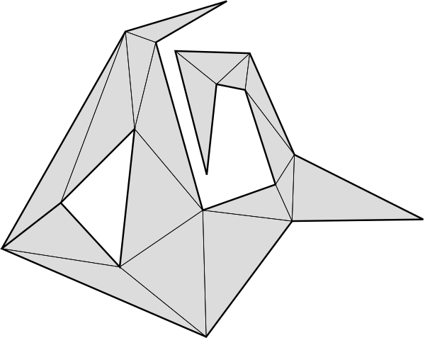 eberly-10.json | 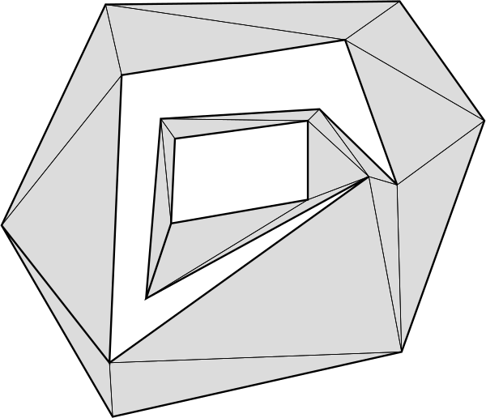 eberly-14.json | 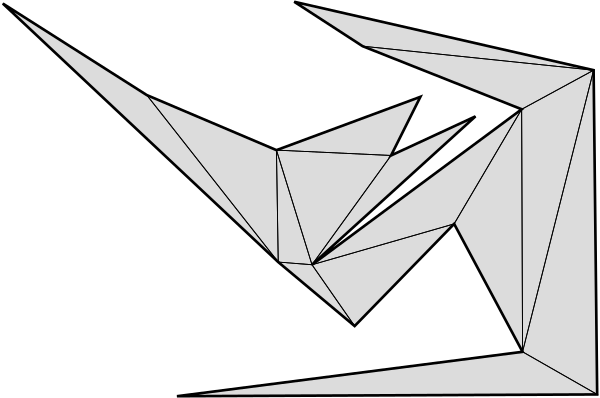 elgindy-1.json | 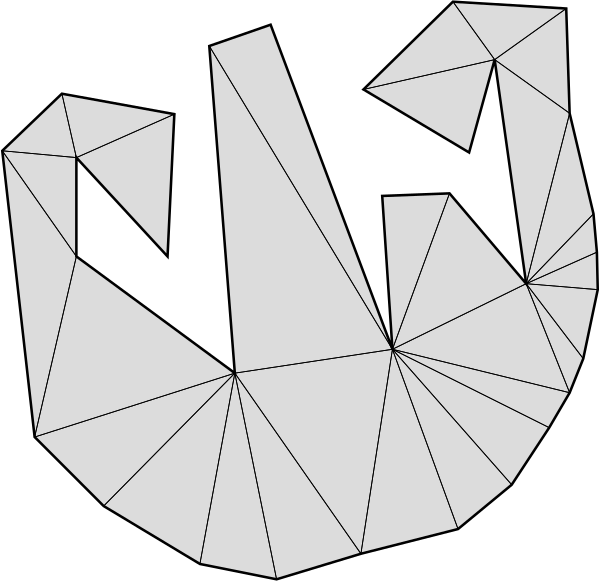 gray-embroidery.json |
| 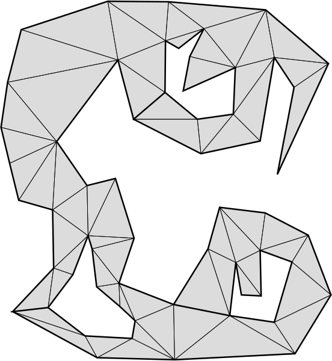 held-1.json | 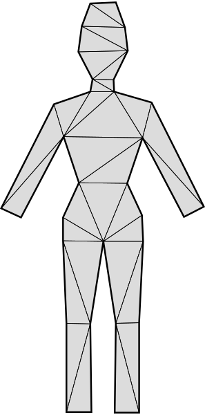 held-12.json | 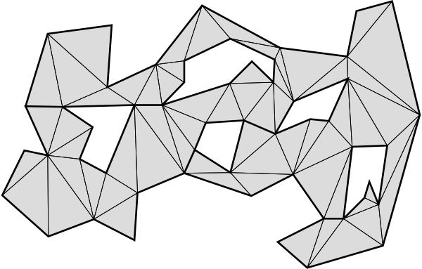 held-3.json | 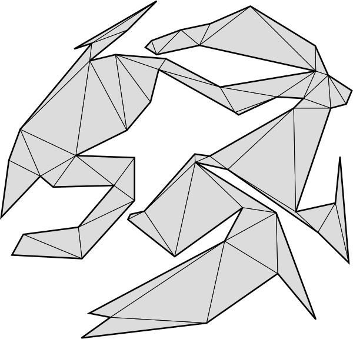 held-7a.json |
| 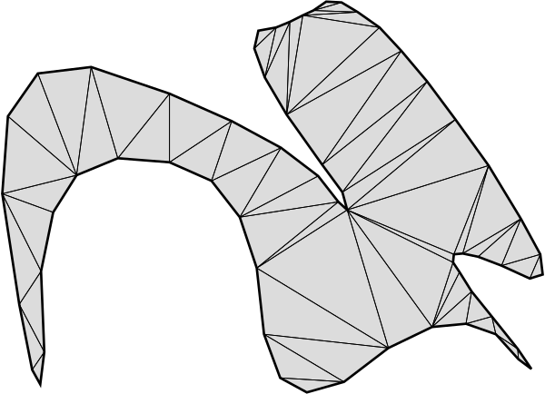 held-7b.json | 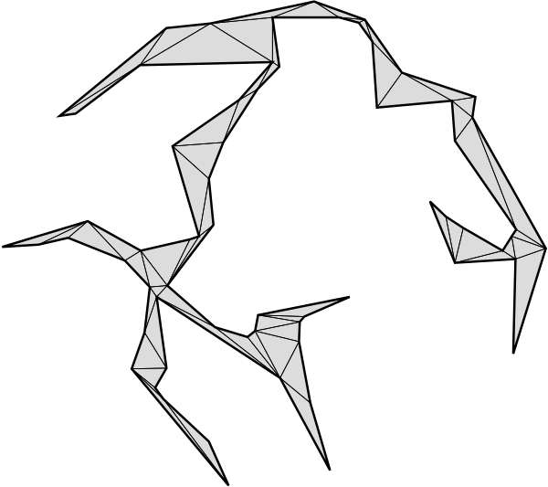 held-7c.json | 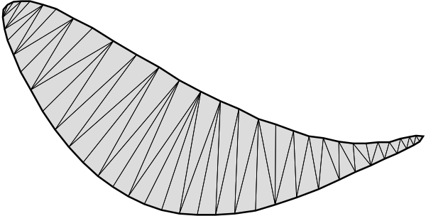 held-7d.json | 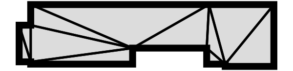 mapbox-building.json |
| 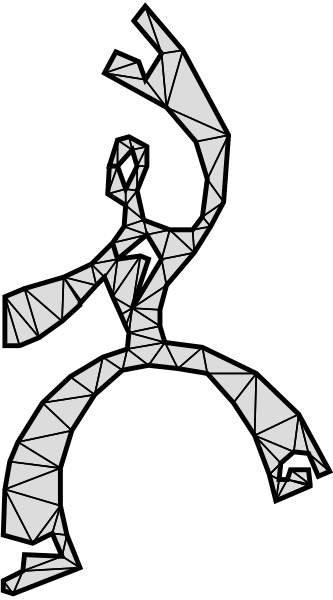 mapbox-dude.json | 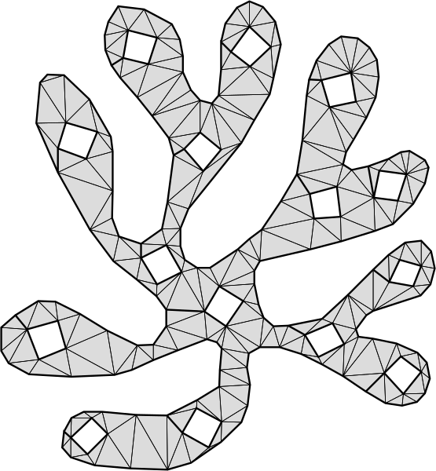 matisse-alga.json | 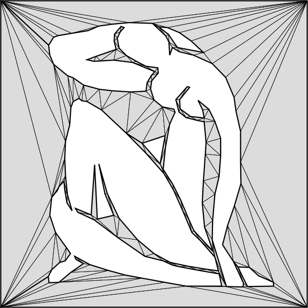 matisse-blue.json | 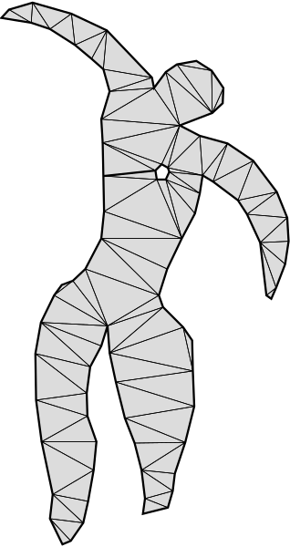 matisse-icarus.json |
| 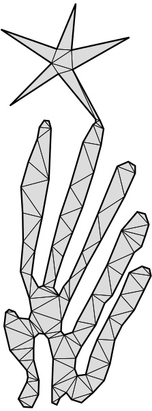 matisse-nuit.json | 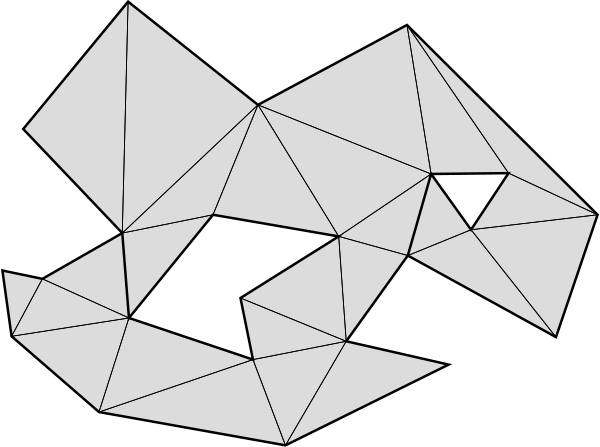 mei-2.json | 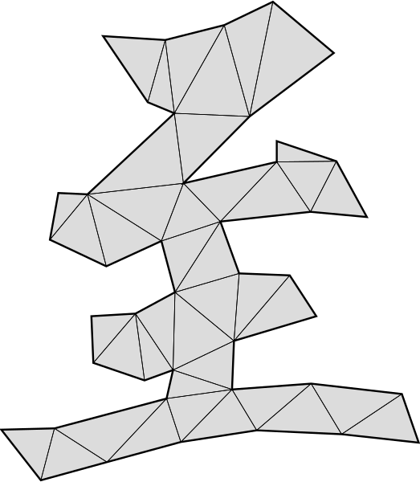 mei-3.json | 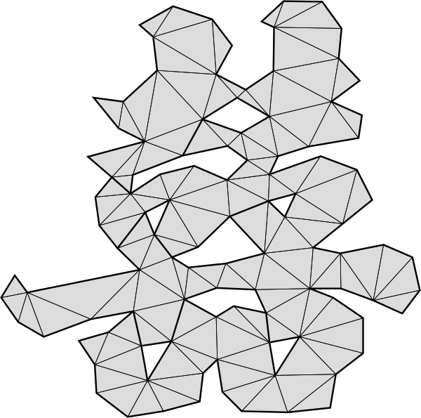 mei-4.json |
| 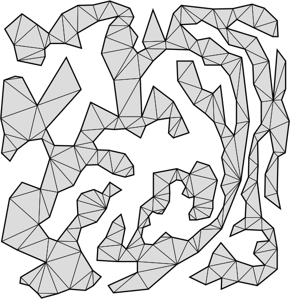 mei-5.json | 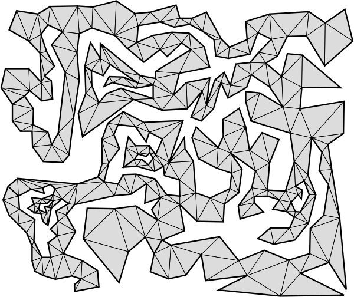 mei-6.json | 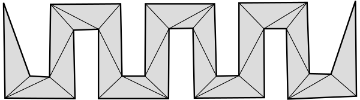 meisters-3.json |  misc-discobolus.json |
| 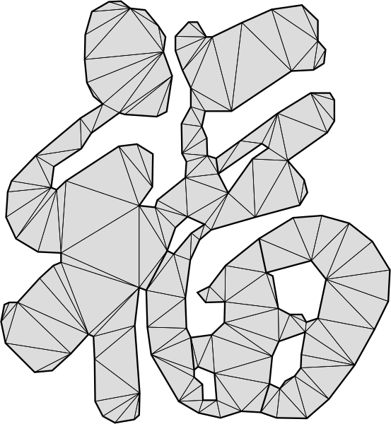 misc-fu.json | 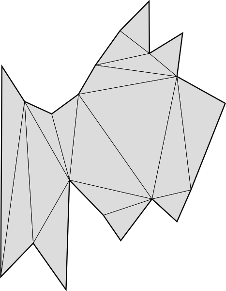 seidel-3.json |  skimage-horse.json | 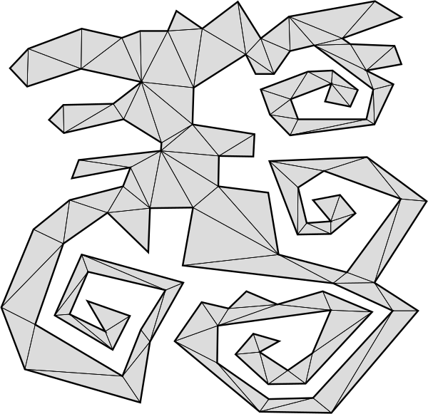 toussaint-1a.json |
 
 
## Metadata 

Basic info about each polygon are stored separately in the `meta` folder as JSON's. Metadata for a polygon looks something like this (re-formatted and commented for explanation):

```javascript
{// meta/skimage-horse.json

  "centroid": [371.77, 390.94], // true polygon centroid (aka center of mass)
  "area":     180144,               // area of polygon
  "bounds":   [24,111,784,732],   // left,top,right,bottom

  // minimum bounding boxes and rectangles
  "rotatedBoundingBox": {"center": [422.99, 480.58], "size": [809.30, 563.60], "angle": -15.34},
  "boundingCircle":     {"center": [408,416.5],"radius": 435.96},

  // convex hull encoded with vertex indices of the outermost contour
  "hull": [1,3,7,27,28,72,73,75,97,100,101,102,105,106,107] 
}
``` 
Visualization of the metadata are stored in the `meta/render` folder. For example:

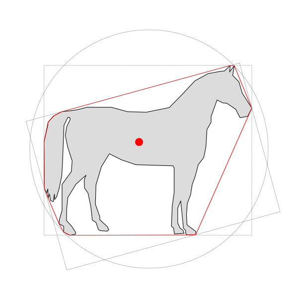

 
## Sources

| File prefix | Source | Note |
|---|---|---|
| `eberly-*` | [David Eberly, "Triangulation by Ear Clipping"](https://www.geometrictools.com/Documentation/TriangulationByEarClipping.pdf) | |
| `elgindy-*` | [ElGindy, H., Everett, H., & Toussaint, G., "Slicing an ear using prune-and-search"](https://www.sciencedirect.com/science/article/pii/016786559390141Y) | |
| `gray-*` | [Theodore Gray, "Embroidered Animation! Finally!"](http://home.theodoregray.com/stitchblog/2015/7/10/embroidered-animation-finally) | |
| `held-*` | [Martin Held, "FIST: Fast Industrial-Strength Triangulation of Polygons"](http://citeseerx.ist.psu.edu/viewdoc/download?doi=10.1.1.49.3013&rep=rep1&type=pdf) | |
| `mapbox-*` | [Mapbox, "Earcut: The fastest and smallest JavaScript polygon triangulation library"](https://github.com/mapbox/earcut) | |
| `matisse-*` | [Paper cut-outs by Henri Matisse](https://en.wikipedia.org/wiki/Henri_Matisse) | |
| `mei-*` | [Gang Mei, John C.Tipper & Nengxiong Xu, "Ear-clipping Based Algorithms of Generating High-quality Polygon Triangulation"](https://arxiv.org/pdf/1212.6038.pdf) | |
| `meisters-*` | [Meisters, G. H., "Polygons have ears"](https://digitalcommons.unl.edu/cgi/viewcontent.cgi?article=1053&context=mathfacpub) | |
| `seidel-*` | [Seidel, R., "A simple and fast incremental randomized algorithm for computing trapezoidal decompositions and for triangulating polygons"](https://www.cs.princeton.edu/courses/archive/fall05/cos528/handouts/A%20Simple%20and%20fast.pdf) | |
| `skimage-*` | [scikit-image: Image processing in Python](https://scikit-image.org/docs/stable/api/skimage.data.html) | |
| `toussaint-*` | [Toussaint, G. T., "Efficient triangulation of simple polygons"](http://asignatura.us.es/fgcitig/Articulos/14-Efficient%20Triangulation%20of%20Simple%20Polygons.pdf) | |


**Supported by the [Frank-Ratchye Studio for Creative Inquiry](http://studioforcreativeinquiry.org) at Carnegie Mellon University.** 